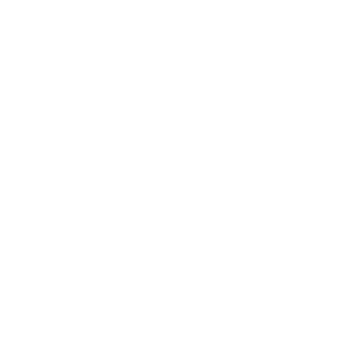
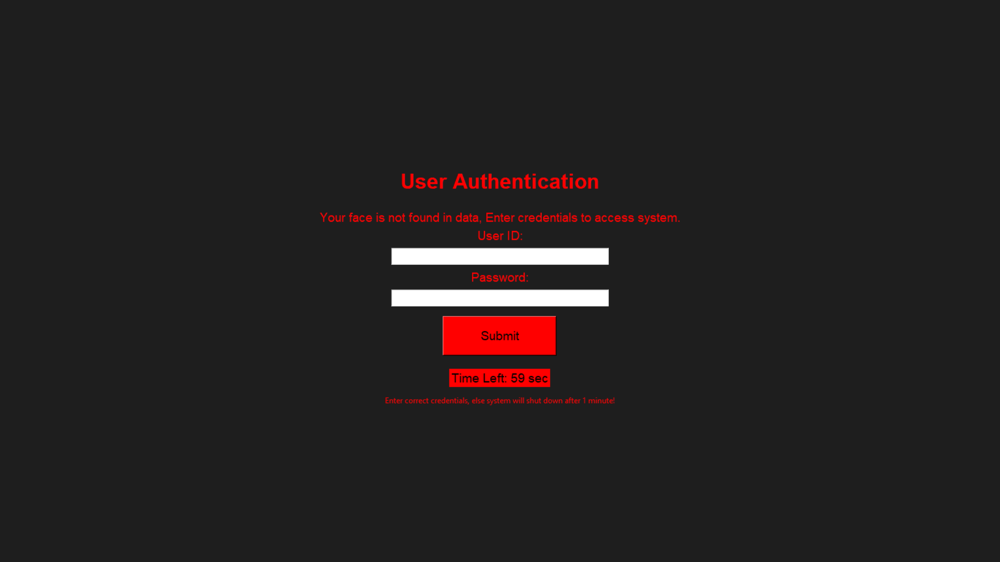
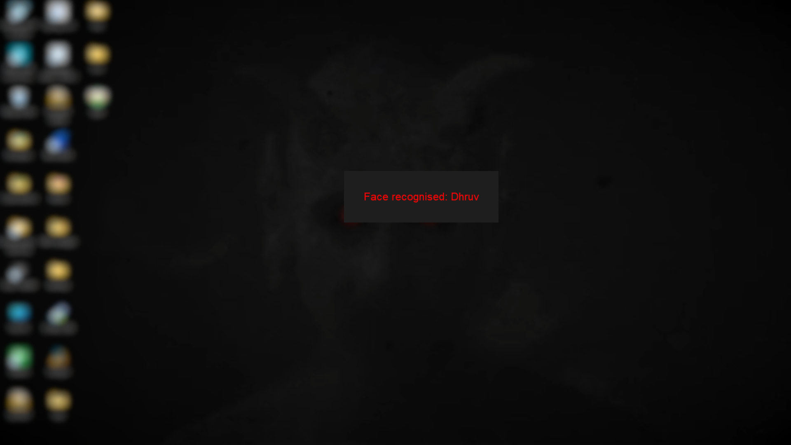

# Facireau
### Face Recognition Authentication System.> 

  
  

- Pronounciation: Face + cireau(garma garam 'sirow')#joke

This repo is made to share and discuss about my best project i've ever made. 
I will share all my emotions, challenges, process and processing of this project.
            
## Let's start by talking about how this is processing.
This is a python(3.10.0) based software which recognises your face(known) and allow you to use your laptop, if unknow face is captured than it will show an authentication panel where it asks for id and password. For fun i made it in such a way that when user is unable to provide credentials in 1 minute + 3 wrong attempts for enterning credentials -> than it will shutdown the pc. And most funny part is that i added it in startup.So, It automatically executes exe. 
## Libraries/Modules I Used

- face_recognition
- tkinter (for GUI)
- opencv
- os,time,requests
- and many more...

## Versions
I made 4 versions of it:-

- [V1.0](# Facireau
### Face Recognition Authentication System.> 

  
  

- Pronounciation: Face + cireau(garma garam 'sirow')#joke

This repo is made to share and discuss about my best project i've ever made. 
I will share all my emotions, challenges, process and processing of this project.
            
## Let's start by talking about how this is processing.
This is a python(3.10.0) based software which recognises your face(known) and allow you to use your laptop, if unknow face is captured than it will show an authentication panel where it asks for id and password. For fun i made it in such a way that when user is unable to provide credentials in 1 minute + 3 wrong attempts for enterning credentials -> than it will shutdown the pc. And most funny part is that i added it in startup.So, It automatically executes exe. 
## Libraries/Modules I Used

- face_recognition
- tkinter (for GUI)
- opencv
- os,time,requests
- and many more...

## Versions
I made 4 versions of it:-

- V1.0 (simple authentication GUI)
- V2.0 (added face recognition to v1.0)
- V2.1 (trial version of v2.0)
- [V3.0](#latest-version-detail) (added location & image sharing to 2.0)

## Images as proof

> [!CAUTION]
> You can't open other apps,task manager.

## Latest version detail

1. Unlocks hidden and locked folder(containing facial references encoded file)
2. Takes Photo from camera
3. Access image encoded file
4. Compare faces(from encoded faces)
5. Show recognition message
6. Else authentication GUI & tries to share location and photo to the owner

